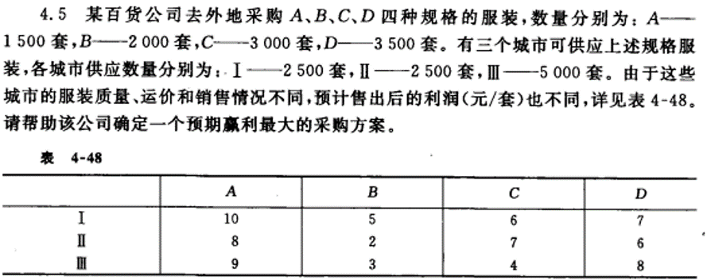

# 实验2：表上作业法
PB20000156  
徐亦昶
## 问题描述
针对下述问题，建立运输问题的数学模型，并用matlab编程，用表上作业法求解之。  

## 问题建模
这是一个运输问题，由于需要求最大值，因此可以把原表中所有元素取相反数，转换为最小值问题。可以得到单位运价表：
| 城市 | 服装 |   |   |   |
|:---:|:---:|:---:|:---:|:---:|
|    | A  | B | C | D |
| Ⅰ  | -10 | -5 | -6 | -7 |
| Ⅱ  | -8  | -2 | -7 | -6 |
| Ⅲ  | -9  | -3 | -4 | -8 |
以及产销平衡表：

| 城市   | 服装 |      |      |      |  产量  |
|:----:|:----:|:----:|:----:|:----:|:----:|
|      | A    | B    | C    | D    |      |
| Ⅰ  |      |      |      |      | 2500 |
| Ⅱ  |      |      |      |      | 2500 |
| Ⅲ  |      |      |      |      | 5000 |
| 销量 | 1500 | 2000 | 3000 | 3500 |      |
## 代码编写
### 找到初始及可行解
使用最小元素法，每次找到单位运价表cost的最小元素，并填入产销平衡表chart，再将该行或该列mask掉（chart相应元素置为inf）。  
代码：
```matlab
%Fill.m
function f=Fill(cost,a,b)
chart=inf*ones(length(a(:)),length(b(:)));
for cnt=1:length(a(:))+length(b(:))-1
    minimum=min(min(cost));
    if(minimum==inf)
        continue;
    end
    [u,v]=find(cost==minimum);
    chart(u,v)=min(a(u),b(v));
    if(a(u)>b(v)) %mask the column
        for row=1:length(a(:))
            cost(row,v)=inf;
        end
        a(u)=a(u)-b(v);
    else %mask the row
        for col=1:length(b(:))
            cost(u,col)=inf;
        end
        b(v)=b(v)-a(u);
    end
end
f=chart;
fprintf("初始基可行解为：\n");
for i=1:length(chart(:,1))
    for j=1:length(chart)
        if(chart(i,j)~=inf)
            fprintf("%d\t",chart(i,j));
        else
            fprintf("-\t");
        end
    end
    fprintf("\b\n");
end
return;
```
### 闭回路法求检验数
首先需要写一个chain函数从某个初始点求出一条闭回路。返回值第一个元素是一个矩阵，每一行对应路径上一点的坐标，第二个元素是寻找成功与否，可以丢弃。该算法使用DFS实现。在本问题规模上，速度还是很快的。
```matlab
%chain.m
function [f,g]=chain(chart,startpos,curpos,direction,vis) %f=[chain,succeed]
if(~all(direction==[0,0])&&all(startpos==curpos)) %Completed
    f=[curpos];
    g=1;
    return;
end
if(~all(direction==[0,0])&&chart(curpos(1),curpos(2))==inf) %Wrong way
    f=[curpos];
    g=0;
    return;
end
if(all(direction==[0,0])) %On start
    direction=[0,1];
    while(direction(2)+curpos(2)<=length(chart(1,:)))
        newpos=curpos+direction;
        if(vis(newpos(1),newpos(2))==1) %already in path
            direction=direction+[0,1];
            continue;
        end
        vis(newpos(1),newpos(2))=0;
        [tmp1,tmp2]=chain(chart,startpos,newpos,direction,vis);
        vis(newpos(1),newpos(2))=1;
        if(tmp2==0) %Not found
            direction=direction+[0,1];
            continue;
        else
            f=[curpos;tmp1];
            g=1;
            return;
        end
    end
    direction=[1,0];
    while(direction(1)+curpos(1)<=length(chart(:,1)))
        newpos=curpos+direction;
        if(vis(newpos(1),newpos(2))==1) %already in path
            direction=direction+[1,0];
            continue;
        end
        vis(newpos(1),newpos(2))=0;
        [tmp1,tmp2]=chain(chart,startpos,newpos,direction,vis);
        vis(newpos(1),newpos(2))=1;
        if(tmp2==0) %Not found
            direction=direction+[1,0];
            continue;
        else
            f=[curpos;tmp1];
            g=1;
            return;
        end
    end
    direction=[0,-1];
    while(direction(2)+curpos(2)>=1)
        newpos=curpos+direction;
        if(vis(newpos(1),newpos(2)==1)) %already in path
            direction=direction+[0,-1];
            continue;
        end
        vis(newpos(1),newpos(2))=0;
        [tmp1,tmp2]=chain(chart,startpos,newpos,direction,vis);
        vis(newpos(1),newpos(2))=1;
        if(tmp2==0) %Not found
            direction=direction+[0,-1];
            continue;
        else
            f=[curpos;tmp1];
            g=1;
            return;
        end
    end
    direction=[-1,0];
    while(direction(1)+curpos(1)>=1)
        newpos=curpos+direction;
        if(vis(newpos(1),newpos(2))==1) %already in path
            direction=direction+[-1,0];
            continue;
        end
        vis(newpos(1),newpos(2))=0;
        [tmp1,tmp2]=chain(chart,startpos,newpos,direction,vis);
        vis(newpos(1),newpos(2))=1;
        if(tmp2==0) %Not found
            direction=direction+[-1,0];
            continue;
        else
            f=[curpos;tmp1];
            g=1;
            return;
        end
    end
else
    if(direction(1)==0)
        direction=[1,0];
        while(direction(1)+curpos(1)<=length(chart(:,1)))
            newpos=curpos+direction;
            if(vis(newpos(1),newpos(2))==1) %already in path
                direction=direction+[1,0];
                continue;
            end
            vis(newpos(1),newpos(2))=0;
            [tmp1,tmp2]=chain(chart,startpos,newpos,direction,vis);
            vis(newpos(1),newpos(2))=1;
            if(tmp2==0) %Not found
                direction=direction+[1,0];
                continue;
            else
                f=[curpos;tmp1];
                g=1;
                return;
            end
        end
        direction=[-1,0];
        while(direction(1)+curpos(1)>=1)
            newpos=curpos+direction;
            if(vis(newpos(1),newpos(2))==1) %already in path
                direction=direction+[-1,0];
                continue;
            end
            vis(newpos(1),newpos(2))=0;
            [tmp1,tmp2]=chain(chart,startpos,newpos,direction,vis);
            vis(newpos(1),newpos(2))=1;
            if(tmp2==0) %Not found
                direction=direction+[-1,0];
                continue;
            else
                f=[curpos;tmp1];
                g=1;
                return;
            end
        end
    else
        direction=[0,1];
        while(direction(2)+curpos(2)<=length(chart(1,:)))
            newpos=curpos+direction;
            if(vis(newpos(1),newpos(2))==1) %already in path
                direction=direction+[0,1];
                continue;
            end
            vis(newpos(1),newpos(2))=0;
            [tmp1,tmp2]=chain(chart,startpos,newpos,direction,vis);
            vis(newpos(1),newpos(2))=1;
            if(tmp2==0) %Not found
                direction=direction+[0,1];
                continue;
            else
                f=[curpos;tmp1];
                g=1;
                return;
            end
        end
        direction=[0,-1];
        while(direction(2)+curpos(2)>=1)
            newpos=curpos+direction;
            if(vis(newpos(1),newpos(2))==1) %already in path
                direction=direction+[0,-1];
                continue;
            end
            vis(newpos(1),newpos(2))=0;
            [tmp1,tmp2]=chain(chart,startpos,newpos,direction,vis);
            vis(newpos(1),newpos(2))=1;
            if(tmp2==0) %Not found
                direction=direction+[0,-1];
                continue;
            else
                f=[curpos;tmp1];
                g=1;
                return;
            end
        end
    end
end
f=[curpos];
g=0;
return;
```
其中startpos和curpos分别为起点和当前所在的点，初始值应该相等；direction递归中需要用到，意思是当前走的方向。刚开始还没有方向，因此初始化为[0,0]；vis表示对应元素是否被访问过，初始化为和chart相同形状的0矩阵。  
接下来是闭回路法的代码：
```matlab
%GetC.m
function f=GetC(cost,chart)
fprintf("空格\t闭回路\t检验数\n");
f=zeros(length(chart(:,1)),length(chart));
for i=1:length(chart(:,1))
    for j=1:length(chart)
        if(chart(i,j)~=inf)
            continue;
        end
        fprintf("(%d%d)\t",i,j);
        circ=chain(chart,[i,j],[i,j],[0,0],zeros(length(chart(:,1)),length(chart)));
        c=0;
        sign=1;
        for k=1:length(circ(:,1))-1
            c=c+sign*cost(circ(k,1),circ(k,2));
            sign=-sign;
            fprintf("(%d%d)-",circ(k,1),circ(k,2));
        end
        fprintf("(%d%d)\t%d\n",circ(length(circ(:,1)),1),circ(length(circ(:,1)),2),c);
        f(i,j)=c;
    end
end
fprintf("检验数表格：\n");
for i=1:length(chart(:,1))
    for j=1:length(chart)
        fprintf("%d\t",f(i,j));
    end
    fprintf("\b\n");
end
return;
```
返回一个新的矩阵，这个矩阵上每一个元素是对应位置的检验数。
### 调整
先确定调入格，然后求闭回路，再求调出格，最后进行调整和换入换出。
```matlab
%Adjust.m
function f=Adjust(chart,exam)
minimum=min(min(exam));
[u,v]=find(exam==minimum);
startpos=[u,v];
circ=chain(chart,startpos,startpos,[0,0],zeros(length(chart(:,1)),length(chart)));
fprintf("由表得(%d,%d)为调入格，由此格出发所作闭回路为",u,v);
for i=1:length(circ(:,1))
    fprintf("(%d%d)-",circ(i,1),circ(i,2));
end
fprintf("(%d%d)\n",circ(length(circ(:,1)),1),circ(length(circ(:,1)),2));
even=circ(2:2:end,:);
theta=inf;
replace_out=even(1,:);
for i = 1:length(even(:,1))
    if(theta>chart(even(i,1),even(i,2)))
        theta=chart(even(i,1),even(i,2));
        replace_out=even(i,:);
    end
end
fprintf("由闭回路可得(%d,%d)为调出格，θ=%d\n",replace_out(1),replace_out(2),theta);
sign=1;
for i=1:length(circ(:,1))-1
    if(all(circ(i,:)==replace_out))
        chart(circ(i,1),circ(i,2))=inf;
        sign=-sign;
        continue;
    end
    chart(circ(i,1),circ(i,2))=chart(circ(i,1),circ(i,2))+theta*sign;
    sign=-sign;
end
chart(circ(1,1),circ(1,2))=theta;
f=chart;
fprintf("调整后的表格为：\n");
for i=1:length(chart(:,1))
    for j=1:length(chart)
        if(chart(i,j)~=inf)
            fprintf("%d\t",chart(i,j));
        else
            fprintf("-\t");
        end
    end
    fprintf("\b\n");
end
return;
```
### 求解主模块
分别把上述模块组合起来，最后求最小值
```matlab
%solve.m
function f=solve(cost,a,b)
chart=Fill(cost,a,b);
exam=GetC(cost,chart);
while(min(min(exam))<0)
    chart=Adjust(chart,exam);
    exam=GetC(cost,chart);
end
fprintf("检验数均不小于0，达到最优。\n");
sum=0;
fprintf("故最小值为");
for i=1:length(chart(:,1))
    for j=1:length(chart)
        if(chart(i,j)~=inf)
            fprintf("%d×%d+",chart(i,j),cost(i,j));
            sum=sum+chart(i,j)*cost(i,j);
        end
    end
end
fprintf("\b=%d。\n",sum);
return;
```
### 主程序，进行调用
针对本问题，在answer.m中进行求解。
```matlab
%answer.m
clear;
cost=[-10,-5,-6,-7;-8,-2,-7,-6;-9,-3,-4,-8];
a=[2500,2500,5000];
b=[1500,2000,3000,3500];
solve(cost,a,b);
```
## 程序输出
直接运行answer.m，输出如下：
```
>> answer
初始基可行解为：
1500	500	500	-
-	-	2500	-
-	1500	-	3500
空格	闭回路	检验数
(14)	(14)-(34)-(32)-(12)-(14)	3
(21)	(21)-(23)-(13)-(11)-(21)	3
(22)	(22)-(23)-(13)-(12)-(22)	4
(24)	(24)-(34)-(32)-(12)-(13)-(23)-(24)	5
(31)	(31)-(32)-(12)-(11)-(31)	-1
(33)	(33)-(32)-(12)-(13)-(33)	0
检验数表格：
0	0	0	3
3	4	0	5
-1	0	0	0
由表得(3,1)为调入格，由此格出发所作闭回路为(31)-(32)-(12)-(11)-(31)-(31)
由闭回路可得(3,2)为调出格，θ=1500
调整后的表格为：
0	2000	500	-
-	-	2500	-
1500	-	-	3500
空格	闭回路	检验数
(14)	(14)-(34)-(31)-(11)-(14)	2
(21)	(21)-(23)-(13)-(11)-(21)	3
(22)	(22)-(23)-(13)-(12)-(22)	4
(24)	(24)-(34)-(31)-(11)-(13)-(23)-(24)	4
(32)	(32)-(31)-(11)-(12)-(32)	1
(33)	(33)-(31)-(11)-(13)-(33)	1
检验数表格：
0	0	0	2
3	4	0	4
0	1	1	0
检验数均不小于0，达到最优。
故最小值为0×-10+2000×-5+500×-6+2500×-7+1500×-9+3500×-8=-72000。
```
## 结论
最终的产销平衡表如下所示：  
| 城市   | 服装 |      |      |      |  产量  |
|:----:|:----:|:----:|:----:|:----:|:----:|
|      | A    | B    | C    | D    |      |
| Ⅰ  | 0 | 2000 | 500 | 0 | 2500 |
| Ⅱ  | 0 | 0 | 2500 |  0 | 2500 |
| Ⅲ  | 1500 |  0 | 0 | 3500 | 5000 |
| 销量 | 1500 | 2000 | 3000 | 3500 |      |

最大利润为72000元。
